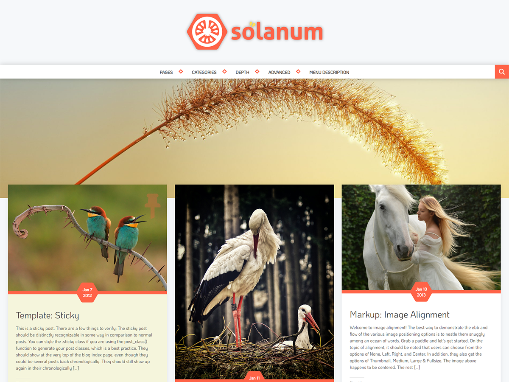

Tomato - Personal Wordpress Theme
===

Tomato lets you build any kind of website from a personal blog, travel, food, to portfolio website for showcasing your works. It uses Bootstrap 4 grid as its base so it's fully Responsive and it has 1080p screen support. This theme support customizer which allow you to change the Background color, Forground color, Header image, Logo, and many more.

### Credits

- [Underscores ( _s )](https://underscores.me)
- [Bootstrap 4](https://getbootstrap.com)
- [Masonry](https://masonry.desandro.com)
- [Genericons Neue](http://genericons.com)
- [Unsplash](https://unsplash.com) and [Pexels](https://www.pexels.com)

### License

Code license is under GPL.

### Creator(s)

**Fajar Setya**

- <https://twitter.com/thedawntale>
- <https://github.com/dawntale>
